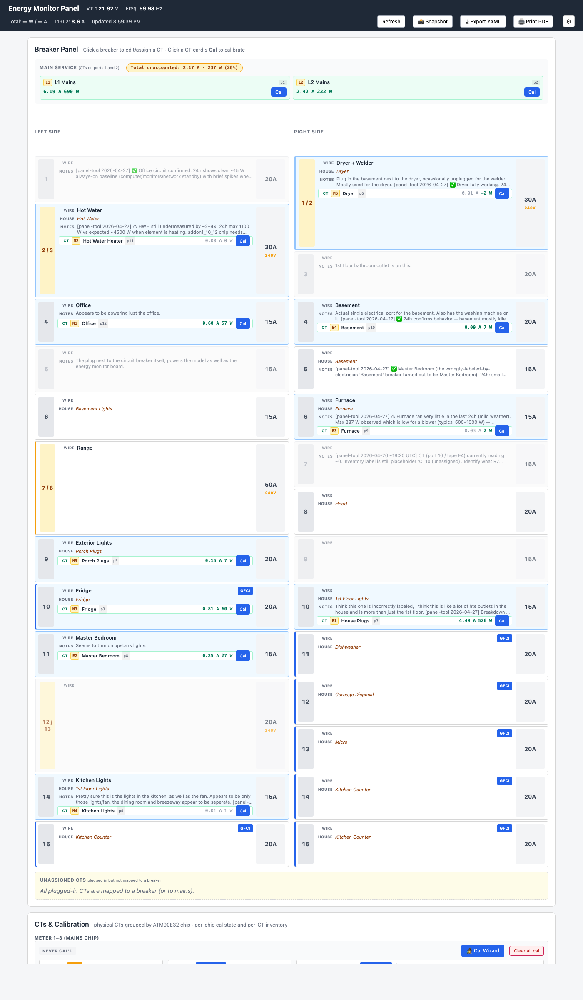
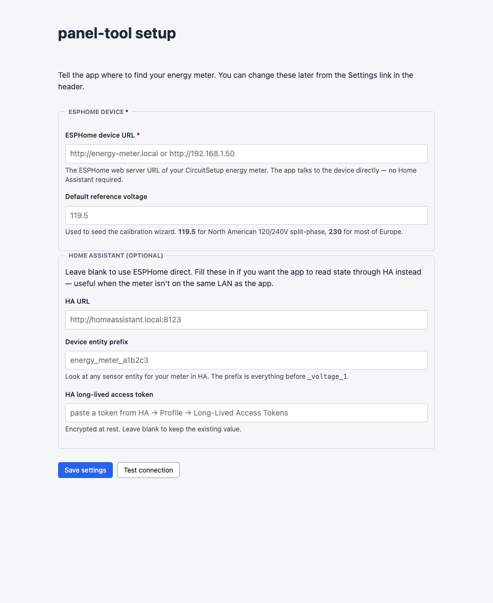
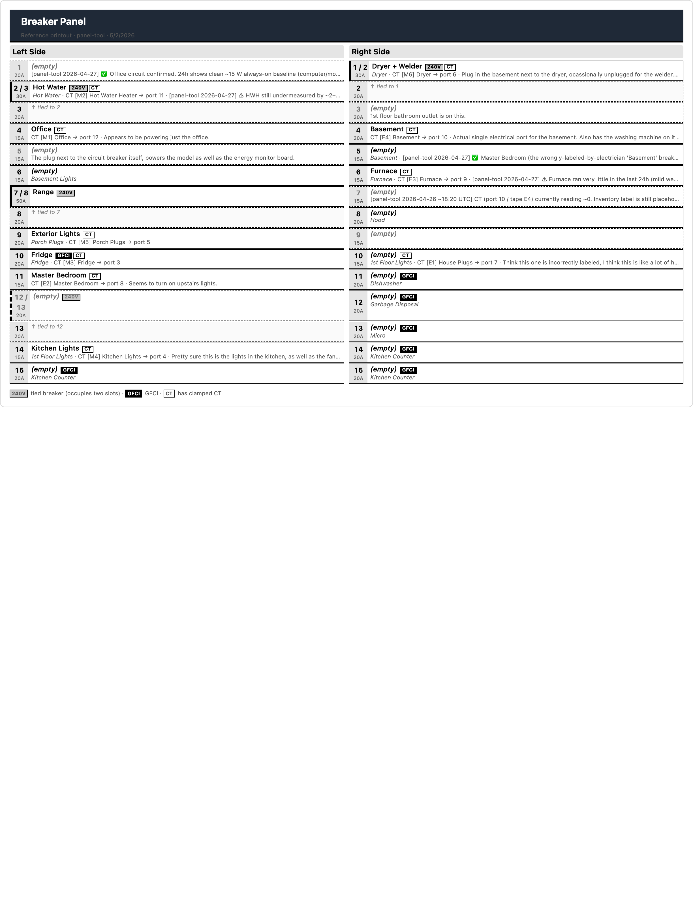
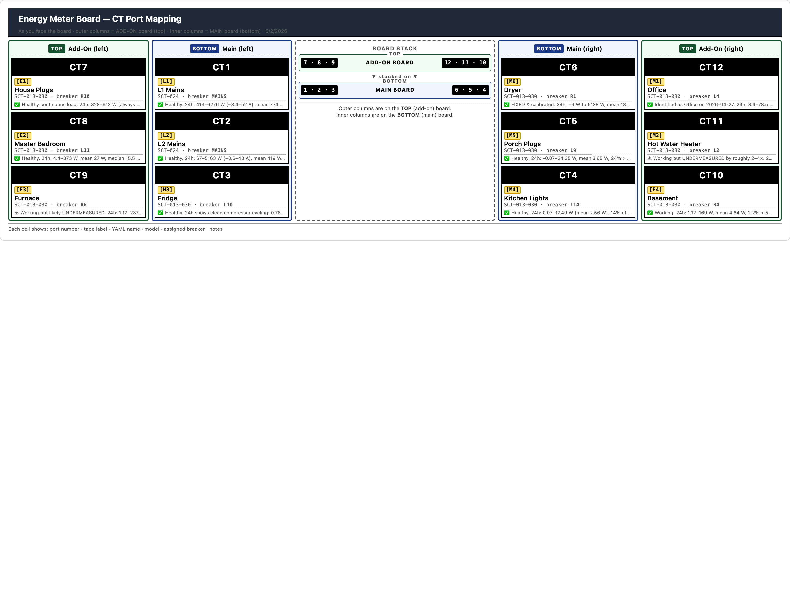

# energy-monitor

A whole-home energy monitor built around the [CircuitSetup Expandable 6-Channel ESP32 Energy Meter](https://github.com/CircuitSetup/Expandable-6-Channel-ESP32-Energy-Meter), Home Assistant, and `panel-tool` — a small web app for the part of the project that the upstream firmware doesn't cover: **figuring out which CT clamps which breaker, calibrating each one, and producing a printout you can stick on the wall next to your panel**.

This repo has three things in it:

| | What | Where |
|---|---|---|
| 1 | An example **ESPHome firmware config** for the meter (12 CTs across one main + one add-on board, 9 V AC voltage transformer, North American 120/240 V split-phase). | `energy_meter.example.yaml` |
| 2 | **`panel-tool`** — a Python web app that maps breakers ↔ CTs, drives the meter's calibration buttons, and prints a 2-page wall-reference PDF of your panel. | `panel-tool/` |
| 3 | **CLI calibration scripts** for people who'd rather automate from the terminal. | `cal.sh`, `cal-ct.sh`, `cal-full.sh` |

If you bought a CircuitSetup meter, threw a dozen CTs at your panel, and now you're staring at twelve identical readings asking *"which one of these is the dryer?"* — this is for you.

## Hardware this targets

- **CircuitSetup 6CH ESP32 energy meter** (main board, optionally with one add-on board → 12 channels total)
- **ATM90E32 metering chip** (4 chips for the 12-channel build)
- A handful of 3.5 mm split-core CTs — `SCT-013-030`, `SCT-013-100`, `SCT-013-000`, or `SCT-024` are all known-good and pre-calibrated in the YAML
- A 9 V AC voltage transformer (the panel-tool's calibration wizard handles non-Jameco VTs too — you just enter your reference voltage)

If you're running a different ESPHome energy meter, panel-tool will probably **not** work — it's coupled to the ATM90E32 entity layout and the CircuitSetup naming conventions.

## What `panel-tool` does

- **Visual breaker panel.** Click a breaker to assign it a CT, set its amperage, mark it as 240 V tied or GFCI, and add notes. Two columns of 15 slots, exactly like a real panel.
- **CT inventory.** Per-CT model, tape label, port number, slug, notes. The model determines the YAML cal value, so changing it updates `current_cal_ctN` in the export.
- **Calibration wizards.** Drives the offset / power-offset / gain calibration buttons on each ATM90E32 chip. Talks to the meter directly via the ESPHome web server, or routes through Home Assistant if you'd rather.
- **YAML export.** One click → an ESPHome `substitutions:` block you paste into your config.
- **Wall-reference PDF.** A 2-page printout (panel layout on page 1, board CT-port mapping on page 2) tuned for sticking next to the panel. Page 2's layout matches the physical board orientation so a future-you (or future-electrician) can read the meter without consulting the laptop.
- **Snapshots.** Saves a JSON snapshot of panel state + live meter readings on demand. Useful for diffing changes over time.

## Screenshots

The main panel view, with breakers on the left and right of the panel, the CT
inventory below, and live mains readings in the header:



First-run setup. Point the app at your meter's ESPHome URL. Home Assistant
fields are optional — if you fill them in, state queries route through HA
instead of the device directly:



The wall-reference printout — page 1 (panel layout, portrait):



…and page 2 (board CT-port mapping, landscape, oriented to match the physical
board so you can read the meter at a glance):



## Three install paths

### 1. Try it on a laptop or Pi (default)

```bash
git clone https://github.com/MCheli/energy-monitor.git
cd energy-monitor
docker compose up
```

The app comes up on `http://127.0.0.1:8000`. SQLite-backed, no Postgres, no nginx, no auth. First page asks you for the URL of your ESPHome meter — paste it in, click Save, and you're going.

### 2. Deploy on your homelab

Read [`panel-tool/docs/DEPLOYMENT.md`](panel-tool/docs/DEPLOYMENT.md). It assumes a homelab pattern of `docker compose` + nginx + per-service Postgres + a `.env` for secrets, with internal-only apps reachable through `*.ops.<your-domain>`. Hand the doc to your ops/infra agent or follow it manually.

### 3. Develop

```bash
cd panel-tool
python3 -m venv .venv && source .venv/bin/activate
pip install -r requirements.txt pytest
SECRET_KEY=dev-only-32+bytes-please \
PANEL_TOOL_DATA_DIR=./data \
  python -m app.server
pytest -q
```

## ESPHome firmware

Copy `energy_meter.example.yaml` to `energy_meter.yaml`, edit the `ctN_name` substitutions for your circuits, set the right `current_cal_ctN` values for your CT models, populate `secrets.yaml` (Wi-Fi + API encryption + OTA password), and `esphome run energy_meter.yaml`.

The example file is set up for a **main + add-on (12 CTs total)** build. If you only have the main board, delete the add-on substitutions, the `addon1_*` filters, and the add-on package import.

## CLI calibration scripts

`cal.sh` calibrates the L1/L2 mains gain via the ESPHome web server (no HA needed). `cal-ct.sh` and `cal-full.sh` do the same for individual branch CTs through the Home Assistant API. All three require env vars (`DEVICE_IP` for `cal.sh`; `HA_URL`, `HA_TOKEN`, `DEVICE_PREFIX` for the HA-routed scripts) and have an editable `case` block at the top mapping circuit-name slugs to ATM90E32 chip groups. Run any of them with no args for usage.

If you're using the panel-tool, you don't need these scripts — the wizard does the same thing through the UI. They're here for shell-driven workflows.

## Project layout

```
energy-monitor/
├── README.md                          ← you are here
├── LICENSE                            ← MIT
├── CONTRIBUTING.md
├── docker-compose.yml                 ← generic, SQLite, localhost
├── .env.example
├── energy_meter.example.yaml          ← ESPHome firmware template
├── cal.sh, cal-ct.sh, cal-full.sh     ← CLI calibration helpers
└── panel-tool/
    ├── README would go here, but the docs are split:
    ├── docs/DEPLOYMENT.md             ← homelab install guide
    ├── app/                           ← Python web server
    ├── alembic/                       ← DB migrations
    ├── static/                        ← HTML / CSS / JS
    ├── tests/                         ← pytest smoke tests
    ├── scripts/import_panel_json.py   ← one-shot legacy importer
    ├── Dockerfile
    └── requirements.txt
```

## Status

This is a personal project that was working well enough on my own panel that I figured someone else might find it useful. It's not a polished product. If you hit something broken, please open an issue — even just to say "this doesn't work for me" with a screenshot.

## License

MIT — see `LICENSE`.

## Credits

- [CircuitSetup](https://github.com/CircuitSetup) for the hardware and the upstream ESPHome firmware.
- [Home Assistant](https://www.home-assistant.io/) and the [Energy Dashboard](https://www.home-assistant.io/docs/energy/) for being the reason I built any of this.
- [3D-printable enclosures](https://github.com/CircuitSetup/Expandable-6-Channel-ESP32-Energy-Meter/tree/master/Hardware/Enclosures) live upstream — print whichever size matches your build.
